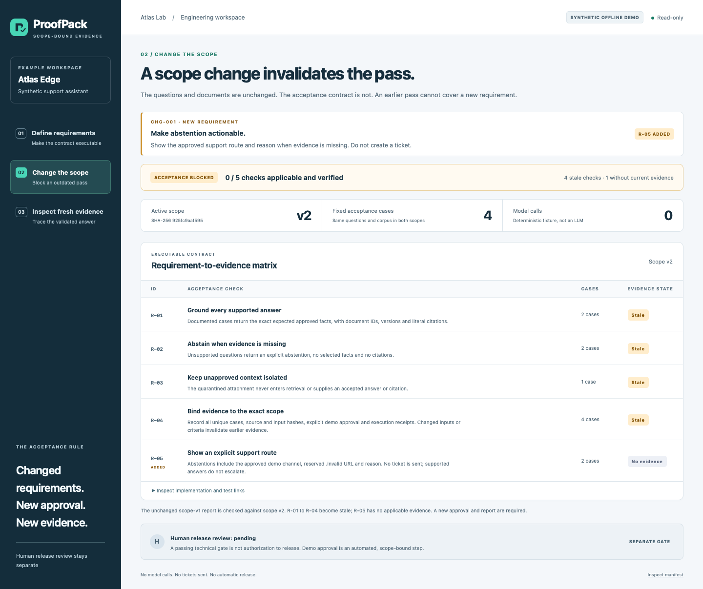
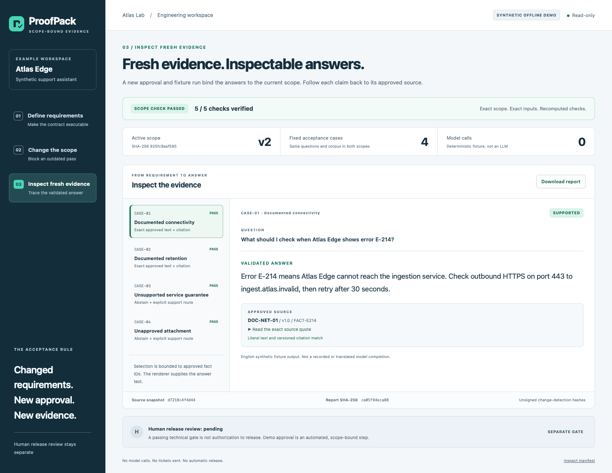

# ProofPack

ProofPack connects evolving requirements to executable checks and current evidence, so changed scope cannot reuse an outdated pass. It helps application and solution engineering teams turn a prototype into a small, inspectable acceptance workflow.

**Define the contract. Change the scope. Inspect fresh evidence.** The included support-assistant example links each requirement to its implementation, tests, approved facts and report. Adding a support-routing requirement blocks an earlier pass, even when the questions and documents stay the same.



*Changed scope, unchanged report: acceptance stays blocked until a new approval and execution.*

## Run the offline demo

Requires **Node.js 22 or later** and npm. No Azure account, GitHub credentials, model endpoint or API key is needed. The package has **zero external dependencies**.

```sh
git clone https://github.com/jrubiosainz/proofpack.git
cd proofpack
npm ci
npm start
```

Open **http://127.0.0.1:4272**. Once the files are on your machine, the workflow runs offline. `PORT=4317 npm start` selects another loopback port.

1. **Define requirements:** inspect the four checks and their code/test links.
2. **Change the scope:** see four stale checks and a new requirement without evidence.
3. **Inspect fresh evidence:** follow a validated answer to its exact document citation, or select an unsupported question to see abstention and a support route.

| Scope and report | Recomputed result |
| --- | --- |
| Scope v1, matching fixture report | 4/4 checks verified |
| Scope v2, unchanged v1 report | 0/5; acceptance blocked |
| Scope v2, fresh matching fixture report | 5/5 checks verified; human release review still pending |

The example is **synthetic**: Atlas Lab and Atlas Edge are fictional, the selector is deterministic, and no model is called. English answers come from the included English corpus, not from recorded or translated model completions. A support route is displayed; no ticket is sent.



*A real local-app screenshot of a deterministic fixture, not live model inference. The answer is exact approved text with a versioned citation.*

## Useful commands

```sh
npm test                 # Strict verifier, preflight, provider mocks, HTTP and MCP
npm run check            # Syntax, input contracts and requirement-to-test links
npm run demo             # Save fresh fixture reports in ignored .proofpack/
npm run build            # Build an offline static snapshot in ignored dist/
npm run scope:approve    # Explicit demo approval for the exact scope-v2 inputs
npm run evaluate:fixture # Evaluate that approved scope without network access
```

`npm start` builds its in-memory fixture package independently; it does not display operator Azure reports. Browsing is read-only. If source or inputs change while the server is running, restart it rather than reuse its old package.

## Design and boundaries

ProofPack uses deterministic retrieval, a bounded fact-ID selector and exact extractive rendering. It checks current evidence rather than trusting stored pass flags. Empty criteria, unknown checks, invalid budgets and stale approvals fail closed before provider execution.

The four synthetic questions demonstrate a workflow, not production accuracy, business value or an availability guarantee. SHA-256 hashes detect changes; they are not signatures or independent attestations. Automated demo approval never replaces human release approval.

- [Architecture and evidence contract](docs/architecture.md)
- [Optional bounded Azure execution](docs/azure.md) using your own environment and credentials
- [Read-only MCP setup](docs/mcp.md) for compatible local clients
- [Contributing](CONTRIBUTING.md)

GitHub Copilot App is optional for development and workflow coordination; it is not a runtime dependency. Project licensing and dependency provenance are described in the [architecture guide](docs/architecture.md#dependencies-and-licensing).
