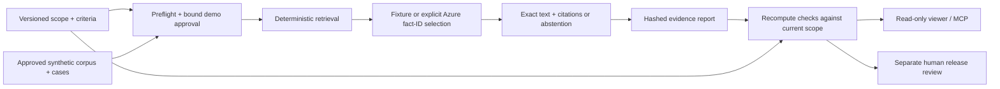

# Architecture



## Runtime

`src/scope.mjs` validates non-empty, unique criteria and cases, registered check versions, synthetic data, input versions and strict budgets. `src/evaluation.mjs` checks **every** case prompt before the first provider invocation. Approval binds the scope, corpus, case set and active requirement definitions.

`src/retrieval.mjs` retrieves at most three facts from approved documents. Quarantined facts are excluded. The fixture or optional Azure model selects only `{ disposition, factIds }`; `src/answer.mjs` supplies exact document text and versioned citations. Unsupported requests abstain. Their `.invalid` support route is data, not an outbound action.

`src/acceptance.mjs` recomputes each criterion from the answers and current inputs. It does not trust stored success flags. Scope v1 and v2 are **requirements versions**, not application releases. The same four cases and corpus are used for both.

## Evidence contract

- `binding` contains SHA-256 hashes of the scope, corpus, cases and active criteria.
- `source` contains a sorted, project-relative file manifest and its hash. The snapshot covers `src/`, `scripts/`, `prompts/`, `samples/`, `public/` and the package manifests. Documentation, images and generated outputs are excluded.
- Offline fixtures use `source-snapshot` provenance, so a downloaded source copy works without Git. They do not claim a clean source commit or actual model usage.
- Azure runs additionally require a clean Git commit, an explicit operator invocation and mode-appropriate request/token receipts. Provider errors remain failed results: no fixture fallback or automatic retry.
- `integrity.contentHash` hashes canonical JSON excluding the `integrity` field. The file-byte SHA-256 printed by CLI commands also detects formatting changes. Neither hash is a signature.

Reports, approvals and generated outputs stay in ignored `.proofpack/` or `dist/`. Do not publish operator reports without reviewing their contents. The included UI always shows new local English fixtures, not measured cloud results. Changing the source while it is running makes evidence reads fail explicitly until restart.

To recheck a saved report without any network calls, substitute the path and file digest printed by `demo` or `evaluate:fixture`:

```sh
npm run verify -- --report REPORT_PATH --sha256 FILE_SHA256 --scope v2
```

The verifier compares with **current** source and inputs. A changed report, source or scope blocks acceptance. It does not silently adapt an old report.

## Read-only surfaces

The loopback server serves an explicit asset allowlist plus `health.json`, `manifest.json`, `view.json` and `evidence.json` (also available under `/api/`). Only GET and HEAD are accepted. Source, credentials and arbitrary filesystem paths are not served.

`npm run build` produces a frozen synthetic snapshot. Its JSON contains the computed gates at build time; it is not a hosted evaluation API. Rebuild after source or input changes. `src/mcp.mjs` is a local stdio reader with three allowlisted tools and no execution, approval or file-browsing capability.

## Limits

This is a small evaluation workbench, not a production support service. The keyword retriever is deliberately simple; a deterministic fixture does not measure model quality. The five checks cover four synthetic cases, not an open-ended assurance claim. New requirement types require an implemented, tested verifier. There is no automatic ticket creation, external release, customer-data connector or human sign-off.

## Dependencies and licensing

Runtime and automated tests use only Node.js built-ins; `package-lock.json` contains no third-party packages or registry URLs. The UI uses system fonts and locally authored HTML, CSS and SVG, with no redistributed external assets. Node.js and any separately installed browser remain under their own licenses.

No open-source license is granted for the project at this time (`UNLICENSED` in the package metadata). Repository visibility does not grant redistribution rights. No blanket license is asserted for external software or assets.
